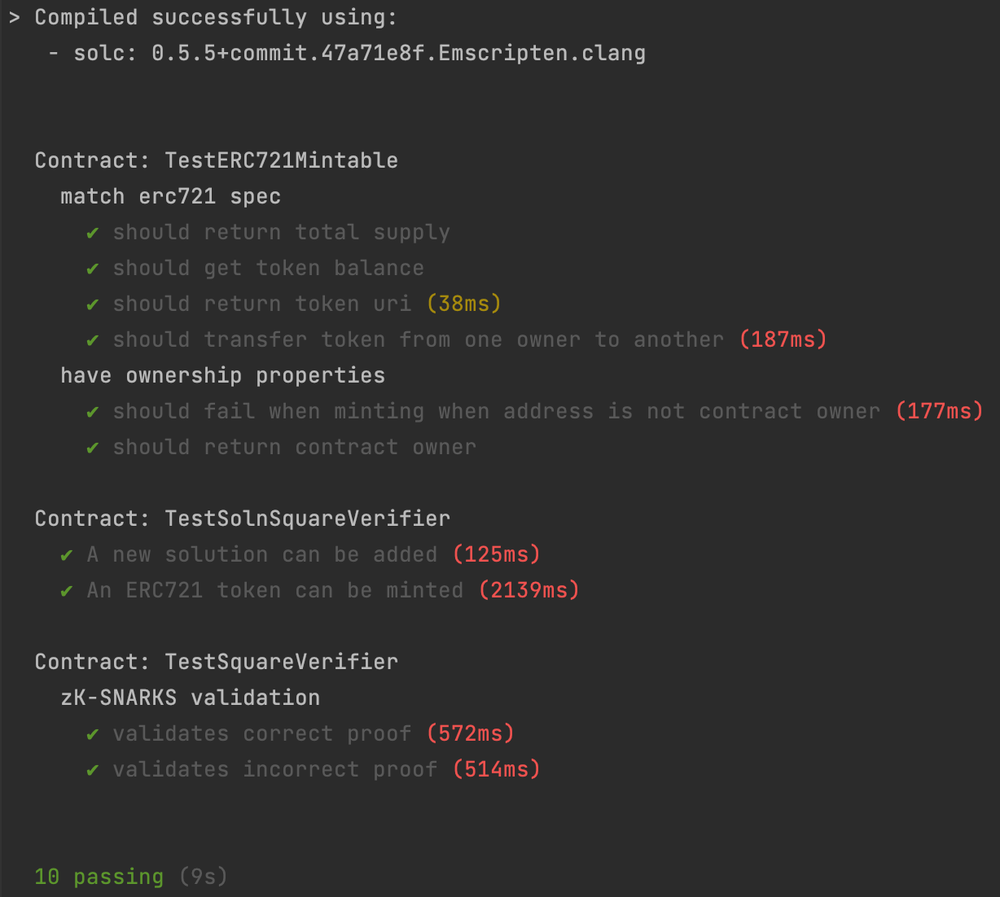

# Udacity Blockchain Capstone Project

This is the Udacity Blockchain Developer ND "Real Estate Marketplace" Capstone Project.

## Install

This repository contains Smart Contract code in Solidity (using Truffle) and tests (also using Truffle).

To install, download or clone the repo, then:

`npm install`
`truffle compile`

## Tests

To run truffle tests:

`truffle test`

## Token details (Rinkeby network)

**Name:** Real Estate Token

**Symbol:** RET

**Etherscan Link:** https://rinkeby.etherscan.io/token/0x0700e952C0FFD7493DAd07b6C6E1549B445e6317

**OpenSea Listing:** https://testnets.opensea.io/collection/real-estate-token-ulaebssqmn

# Project Resources

* [Visual Studio Code](https://code.visualstudio.com/)
* [Truffle Framework](https://truffleframework.com/)
* [Ganache](https://truffleframework.com/ganache)
* [Open Zeppelin](https://openzeppelin.org/)
* [Docker](https://docs.docker.com/install/)
* [ZoKrates](https://github.com/Zokrates/ZoKrates)
* [Infura](https://infura.io/)

